# Cropped Text Recognition
El objetivo principal de este proyecto es desarrollar e implementar un sistema de reconocimiento de texto capaz de identificar y transcribir el texto presente en imágenes que contengan palabras. 

## 1. Cargar Datos / Bases de Datos

En el proceso de carga de datos, se utilizan los módulos necesarios para obtener las imágenes y sus respectivas etiquetas contenidas en las bases de datos utilizadas. En este proyecto se han utilizado dos conjuntos de datos diferentes para entrenar y evaluar el sistema de reconocimiento de texto:
### 1.1 IIIT-5K Word Dataset

Se ha utilizado para realizar pruebas y evaluaciones. IIIT-5K Word Dataset consta de aproximadamente 5,000 imágenes de palabras en inglés reales y no sintéticas. Este conjunto de datos fue recolectado y anotado por el Centro de Visión e Imágenes por Computadora (CVIT) del Instituto Internacional de Tecnología de la Información de Hyderabad (IIIT-H). 
Para el conjunto de datos IIIT-5K Words, se recopila la imagen y el texto de fuentes separadas. Las palabras se obtienen de un archivo de texto que relaciona los nombres de archivo con las palabras correspondientes.
Propiedad interesate: todas las palabras están en mayúsucula.
### 1.2 Dataset MJSynth

Utilizado para las pruebas oficiales de evaluación. MJSynth consiste en datos sintéticos generados automáticamente y contiene alrededor de 90,000 imágenes de palabras en inglés. 
En el caso de MJSynth, la palabra se extrae directamente del nombre del archivo.
Recalcar que hemos entrenado tan solo con 15G.
## 2. Preprocesamiento

Aunque no sea necesario para una CNN, se recomienda aplicar un tamño fijo de imagenes, así nos aseguramos que los filtros convolucionales sean aplicados consistentemente en todas las imágenes, permitiendo que las características extraídas sean comparables y consistentes en todo el conjunto de datos.Es por eso que todas las imagenes son introducidas dentro de un rectangulo de un tamaño determinado:

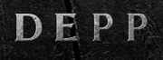
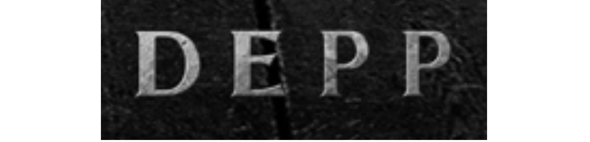

Para saber que tamaño escoger, hemos analizados los diferentes tamaños que encontramos en el dataset. Visualizando la distribución de tamaños vemos en los dos conjuntos de datos una zona mucho mas concentrada.
### 2. Distribución tamaño IIIT

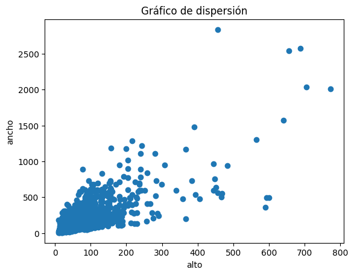
### 2. Distribución tamaño MJSynth

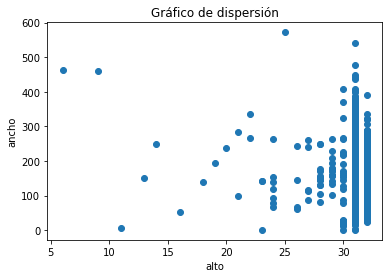

Además, tenemos la opción de aplicar técnicas de aumento de datos a una imagen. Estas técnicas incluyen cambios en la apariencia fotométrica, como desenfoque gaussiano, dilatación y erosión. También se realizan transformaciones geométricas, como cambios en la posición y escala de la imagen. Además, se ajusta el brillo, se agrega ruido y se invierte la imagen. Estas modificaciones no busca aumentar la cantidad de imagenes, si no enriquecer el conjunto de datos.


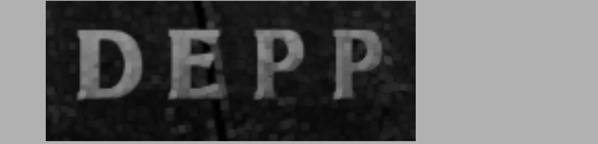

## 3. Estructurar NN
A continuación se crea la estructura de la red neuronal, en nuestro caso está compuesta de una CNN, una RNN y una CTC.

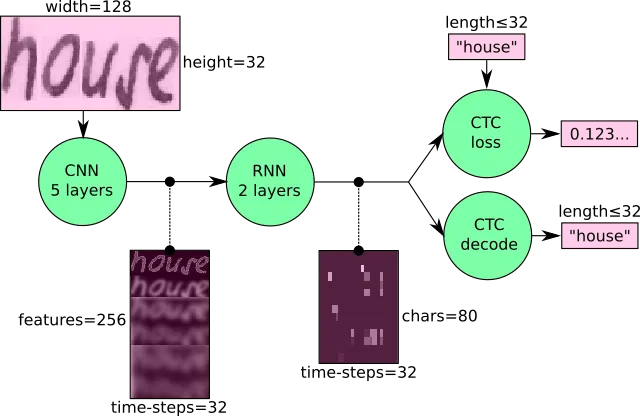

### 3.1 Redes neuronales convolucionales (CNN)

La primera etapa consiste en extraer características de la imagen utilizando cinco capas de CNN. Se definen filtros, valores de características, stride y pooling para controlar la reducción de la resolución espacial en cada capa. En cada capa, se realiza una convolución, se aplica normalización, una función de activación ReLU y un max pooling.
### 3.2 Redes neuronales recurrentes (RNN)

A continuación, las características obtenidas en la CNN se pasan a dos capas de RNN, específicamente LSTM (Long-Short Term Memory), que modelan la secuencialidad y las dependencias temporales en el texto. Esto proporciona las probabilidades de clasificación para cada característica, es decir, las probabilidades de que pertenezcan a cada carácter.
### 3.3 Connectionist Temporal Classification (CTC)

Para alinear la secuencia de entrada con la secuencia de salida, dado que el output es una secuencia de longitud variable, se utiliza el decodificador CTC. Se utiliza un nuevo carácter llamado 'blankspace' para capturar y representar correctamente la estructura y el orden de los elementos en la secuencia de salida, modelando adecuadamente la repetición de caracteres. El repositorio proporciona dos algoritmos de búsqueda para calcular la secuencia más probable: BestPath y BeamSearch.
#### 3.3.1 BestPath

BestPath selecciona el símbolo con mayor probabilidad en cada paso de tiempo y los concatena para formar la secuencia resultante.
#### 3.3.2 BeamSearch

BeamSearch busca las N secuencias más probables (determinado por el tamaño del beam) y selecciona la secuencia final con mayor probabilidad.
#### 3.3.3 Función de pérdida y optimizador

La función de pérdida utilizada es CTC loss, que se calcula como el negativo del logaritmo de la suma de las probabilidades de alineación. Como optimizador, se utiliza Adam (Adaptive Moment Estimation) para una actualización más precisa de los pesos de la red.
### 4. Detalles de implementación Concretos
#### 4.1 Estructura de Github
```
├── main.py
├── test.py
├── train.py
├── preprocess.py
├── data_loader.py
├── model.py
└── data/
    ├── IIIT/
    └── MJSynth/
```
En la estructura de GitHub, tenemos los siguientes archivos y carpetas:

    main.py: El archivo principal que contiene el punto de entrada de la aplicación.
    test.py: Archivo para realizar pruebas y evaluaciones del sistema.
    train.py: Archivo para entrenar el modelo.
    preprocess.py: Archivo que contiene funciones de preprocesamiento de datos.
    data_loader.py: Archivo que carga los datos y prepara las imágenes y etiquetas para su uso en el modelo.
    model.py: Archivo que define la arquitectura del modelo de reconocimiento de texto.
    data/: Carpeta que contiene los conjuntos de datos utilizados.
        IIIT/: Carpeta que contiene los datos del conjunto de datos IIIT.
        MJSynth/: Carpeta que contiene los datos del conjunto de datos MJSynth.
        
#### 4.2 Argumentos de línea de comandos
```
    --decoder: selecciona entre los decodificadores CTC "bestpath", "beamsearch" y "wordbeamsearch". Por defecto es "bestpath". Para la opción "wordbeamsearch", consulta los detalles a continuación.
    -- data_augmentation: aplica técnicas de data augmentation
    -- img_file: image that is used for inference.
    -- minusula: utilizar solo minúsculas
    -- mayuscula: utilizar solo mayúsuculas
```
#### 4.3 Opción Inferencia
La opción de "inferencia" permite utilizar una imagen de entrada y obtener la palabra correspondiente después de haber entrenado el modelo. Es una forma de evaluar el rendimiento del sistema en la tarea de reconocimiento de texto.

### 5. Pruebas / Resultados
Se han tenido en cuenta dos casos. El entrenamiento teniendo en cuenta cada uno de los carácteres posibles (mayúsculas y minúsuculas incluidas) y solo minúsculas, ya que son los valores que mas predominan en nuestro dataset.
A continuación se presentan los valores de precisión y pérdida obtenidos en la prueba con ambos algoritmos de búsqueda. Teniendo en cuenta todos los chars posibles (mayúsculas y minúsculas).

#### 5.1 Utilizando Mayúsuculas y Minúsculas

#### BestPath - MJSynth
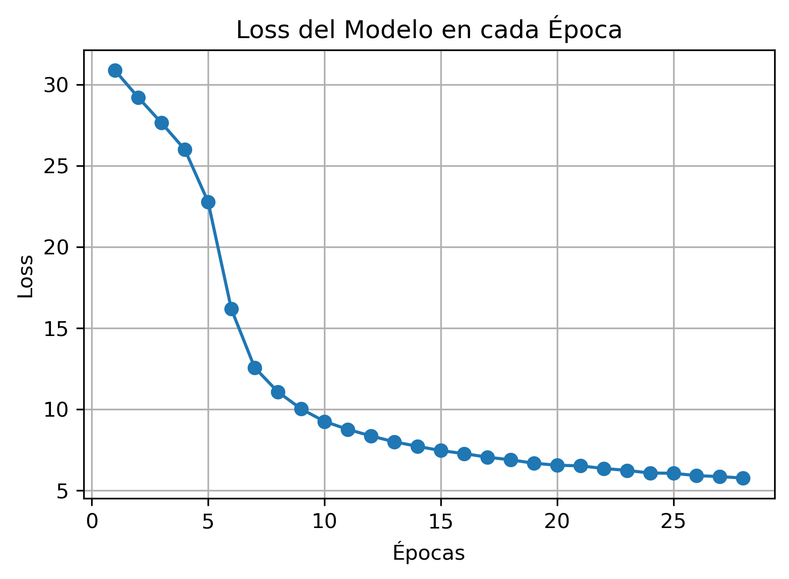
La función de pérdida alcanza un valor de 6.2, lo cual indica que el modelo tiene un nivel moderado de error en la tarea de reconocimiento de texto. Esto sugiere que el modelo necesita ajustes adicionales para mejorar su rendimiento.
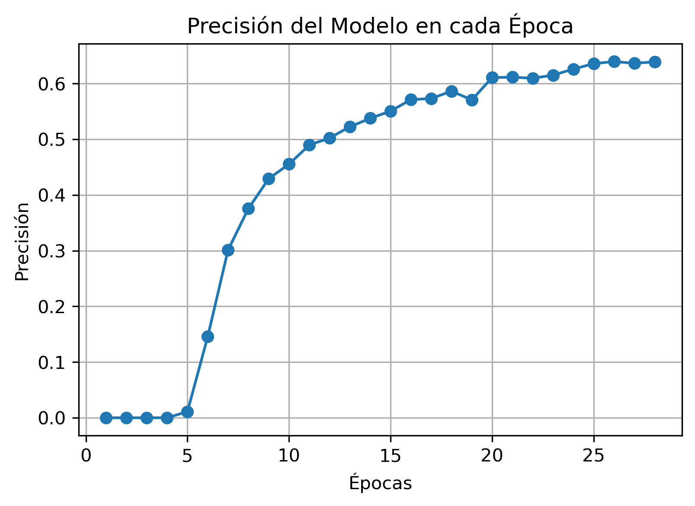
La precisión alcanza un valor del 64.8%, lo que significa que el modelo acierta correctamente aproximadamente el 64.8% de las muestras evaluadas. Si bien esta precisión es aceptable, aún hay margen para mejorar el rendimiento del modelo y aumentar la precisión en futuras iteraciones.
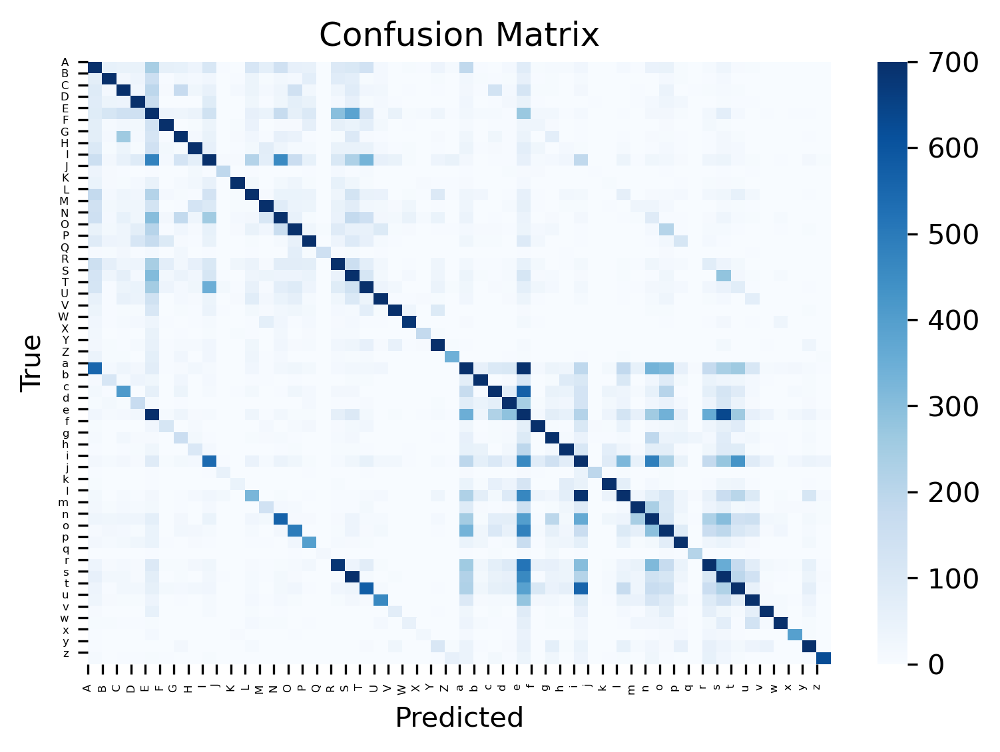
La matriz de confusión muestra una línea diagonal pronunciada, lo cual indica que la mayoría de las predicciones son correctas. Sin embargo, se observa una línea paralela a la diagonal, lo que sugiere que el modelo tiende a confundir mayúsculas y minúsculas en algunas letras. Específicamente, se observa que las letras "e" y "i" son más propensas a ser confundidas. Además, se aprecia que el modelo tiende a predecir más letras en minúsculas que en mayúsculas.

#### BestPath - IIIT
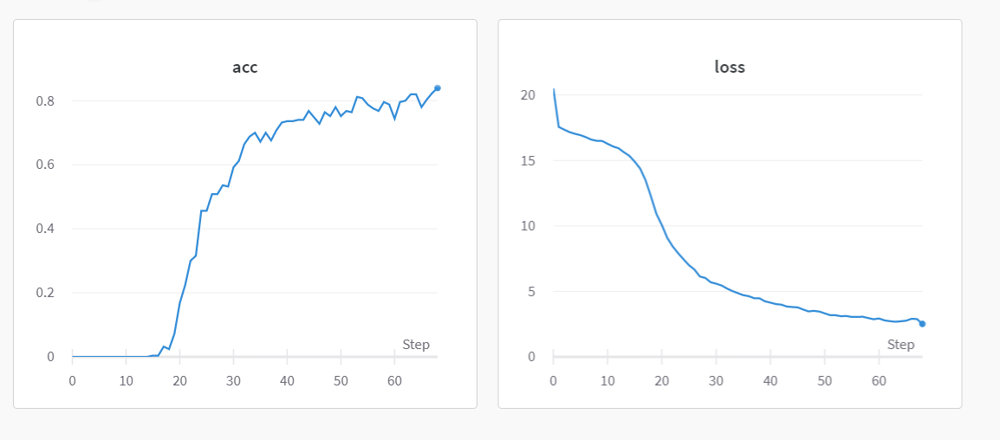
Se ha obtenido una precisión del 80.3%, lo que indica que el modelo tiene un alto rendimiento en la tarea de reconocimiento de texto. Esta precisión es considerablemente mayor que en el caso anterior, lo cual sugiere que el modelo está funcionando mejor en un conjunto de datos en el que solo hay letras mayúsculas.

La función de pérdida es de 2.1, lo que indica que el modelo tiene un nivel bajo de error. Este resultado es coherente con la alta precisión obtenida, lo que sugiere que el modelo ha aprendido eficazmente las características.

En este conjunto de datos, solo se encuentran letras mayúsculas. Este hecho nos puede indicar que uno de los cuellos de botella se encuentra en el aprendizaje de las variaciones entre letras mayúsculas y minúsculas.

#### BeamSearch - MJSynth

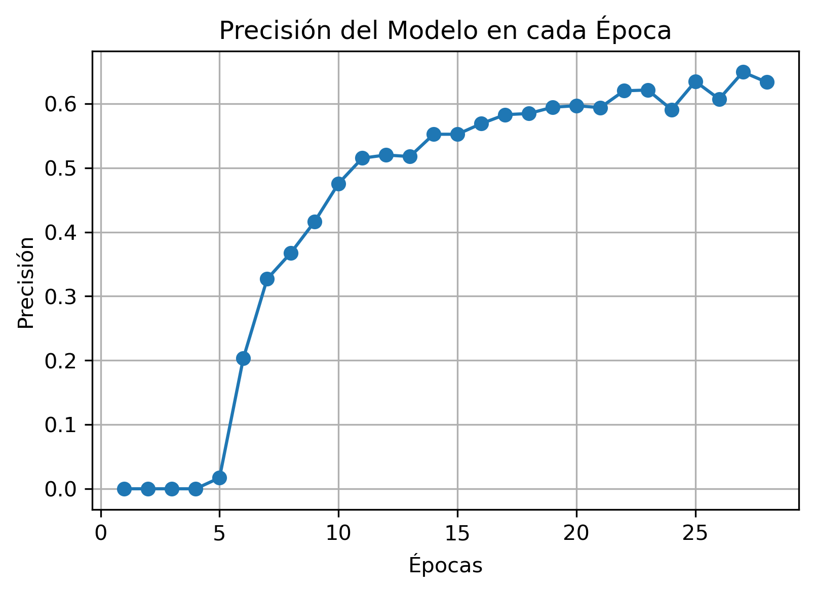
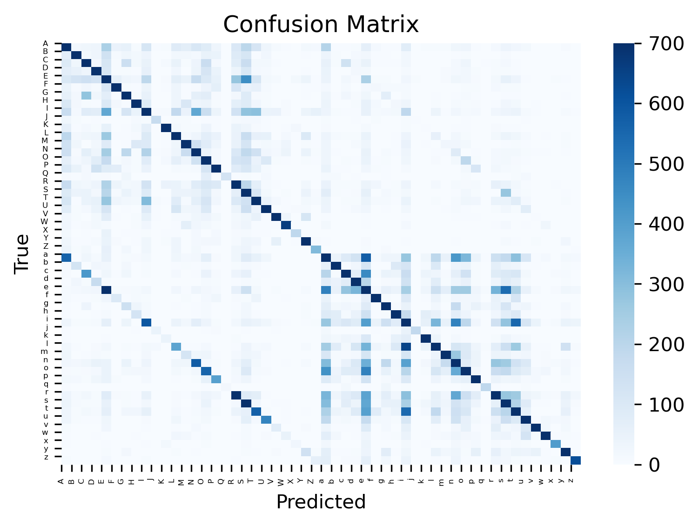
Es interesante observar que, a pesar de cambiar el algoritmo de decodificación, los resultados obtenidos siguen siendo similares, con una precisión de alrededor de 63.5% y una pérdida de alrededor de 5.8%. Esto sugiere que la restricción en el rendimiento del sistema no se encuentra en el algoritmo de decodificación en sí.

#### 5.2 Uso exclusivo de minúsculas
Después de realizar un análisis exhaustivo, descubrimos que el número de minúsculas en el dataset es significativamente mayor, con 9,193,336 minúsculas en comparación con 5,264,306 mayúsculas. 

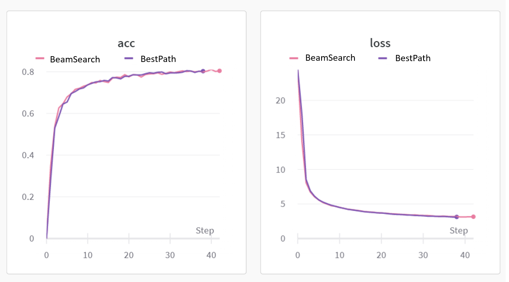
Se aprecia una precisión de aproximadamente 0.8 en los dos casos y una loss de 0.2 mas o menos.
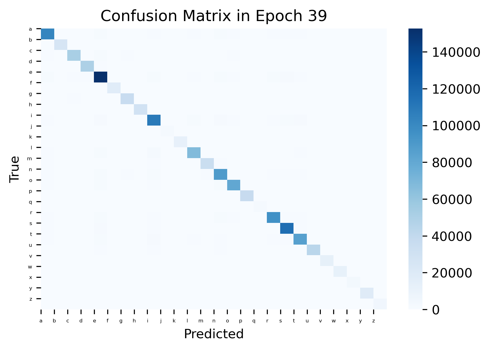
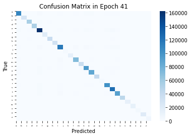
Estos resultados respaldan nuestra hipótesis inicial de que el modelo tiene un desempeño superior al trabajar con letras minúsculas.

### 6. Créditos
A continuación, se mencionan los créditos y las fuentes utilizadas en el desarrollo del proyecto:

 - IIIT-5K Word Dataset: El conjunto de datos fue recolectado y anotado por el Centro de Visión e Imágenes por Computadora (CVIT) del Instituto Internacional de Tecnología de la Información de Hyderabad (IIIT-H). Puedes acceder a este dataset en el siguiente [enlace](https://cvit.iiit.ac.in/research/projects/cvit-projects/the-iiit-5k-word-dataset).
 - MJSynth Dataset: Este dataset fue generado automáticamente y está disponible en el siguiente [enlace](https://www.robots.ox.ac.uk/~vgg/data/text/).
 - Código base del proyecto: El código base utilizado en este proyecto se basa en el repositorio SimpleHTR desarrollado por [Harald Scheidl](https://github.com/githubharald).

## 7. Colaboradoras
Nina Stekacheva Sancho - nina.stekacheva@autonoma.cat
Paula Serrano Sierra - paula.serranos@autonoma.cat

Xarxes Neuronals i Aprenentatge Profund
Grau de Data Engineering, 
UAB, 2023
